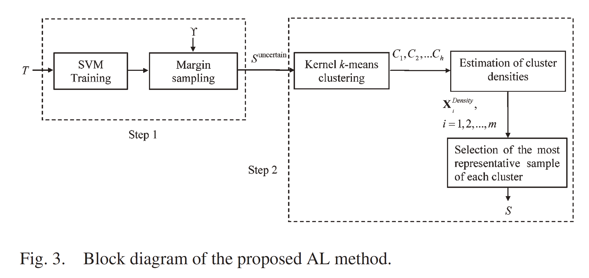

# Active Learning for Remote Sensing Image Retrieval
Unofficial implementation of paper [A Novel Active Learning Method in Relevance
Feedback for Content-Based Remote
Sensing Image Retrieval](https://ieeexplore.ieee.org/document/6920022/)

## Usage

### Running locally 
1. Clone this Repository  
2. Download and Unzip the [UCMerced_LandUse](http://weegee.vision.ucmerced.edu/datasets/landuse.html) dataset  
3. Open rf_al.ipynb in Jupyter Notebook  
## Result
| Metric            | Reported | Our Implementation |
|-------------------|----------|--------------------|
| Average Precision | 69%      | 68.69%             |
## Acknowledgements
[Kernel K-means](https://gist.github.com/mblondel/6230787)